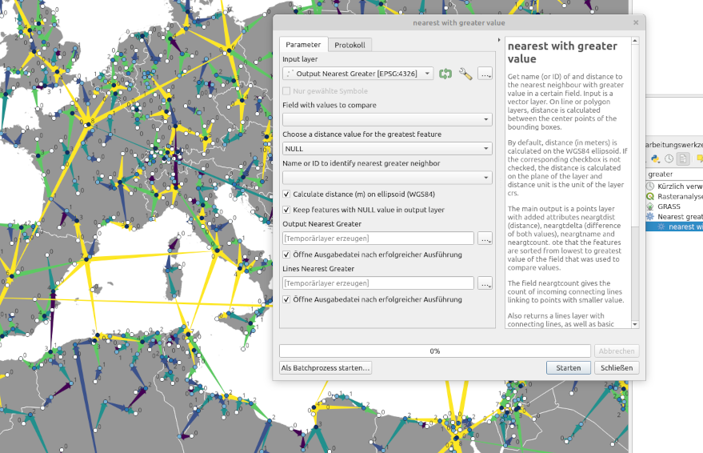

# QGIS plugin nearest greater 
QGIS plugin to get name (or ID) of and distance to the nearest feature with greater value in a certain field; for every feature of a vector layer.

- Homepage: [https://www.riannek.de/code/qgis-nearest-with-greater/](https://www.riannek.de/code/qgis-nearest-with-greater/)
- Sourcecode: [https://github.com/florianneukirchen/qgis_nearest_greater](https://github.com/florianneukirchen/qgis_nearest_greater)
- QGIS Plugin Repository: https://plugins.qgis.org/plugins/qgis_nearest_greater/
- Bug Tracker: https://github.com/florianneukirchen/qgis_nearest_greater/issues

## About
For each feature on a vector layer, get name (or ID) of and distance to the nearest neighbour *with greater value* in a certain attribute field. On line or polygon layers, distance is calculated between the center points of the bounding boxes. Since version 2.0, distance is calculated on the WGS84 ellipsoid (not on the layer plane) by default. If the corresponding checkbox is not checked, the distance is calculated on the plane of the layer and distance unit is the unit of the layer CRS.

The main output is a points layer with added attributes 'neargtdist' (distance in meters), 'neargtdelta' (difference of both input values), 'neargtname' (name or ID) and 'neargtcount'. The field 'neargtcount' gives the count of incoming connecting lines linking to points with smaller value. Note that the features are sorted from lowest to greatest value of the field that was used to compare values.

Also returns a lines layer with connecting lines, as well as basic statistics of the distances (min, max, mean, quartiles). 

Use cases: 
- Which is the next larger city? 
- How far away is the next higher building?
- Which is the closest peak with higher elevation? 
- Useful for spatial analysis 
- Useful to categorize features in order to apply different styles (e.g. major and minor summits). 

## Limitations
The plugin uses the spacial index of QGIS, which works on a plane, not on a globe. Some "nearest neighbors" might be incorrect if the correct nearest neighbor is on the other side of the datum line or one of the polar regions. However, this is only problematic if you are working with global data. 

## Changelog

### 2.0 (2023-02)
- Take any geometry as input, not only point layers. The distance is calculated from the centers of the bounding boxes. This also fixes a bug that caused an exception with Multipoint geometries.
- By default, distance is now calculated on the WGS84 ellipsoid. The old behaviour (distance on the plane of the layer) is still available as an option. 
- Bugfix: Catch exception when comparing strings and trying to calculate delta.

### 1.1 (2023-01)
- Set QGIS minimum version to 3.18 

### 1.0 (2022-10)
- Add additional output field neargtdelta with the diffence of both values
- Calculate statistics for delta
- Improve strings in the UI

### 0.3 (2022-09)
- Fix a bug by changing the names of added fields to neargtdist, neargtname, neargtcount: Don't use underscore. Before, they were renamed by QGSIS when the layer was saved to a shapefile.

### 0.2 (2022-09)
- Return additional field 'neargtcount' with a count of the incoming links (i.e. connecting lines from points with smaller value)
- Better handling of the distance value for the feature with greatest value. Three options: "NULL", "1 Mio.", "max distance + 1".
- Warn if the selected name field contains NULL or non-unique values
- Add short help string

### 0.1 (2022-09)
- Initial release

